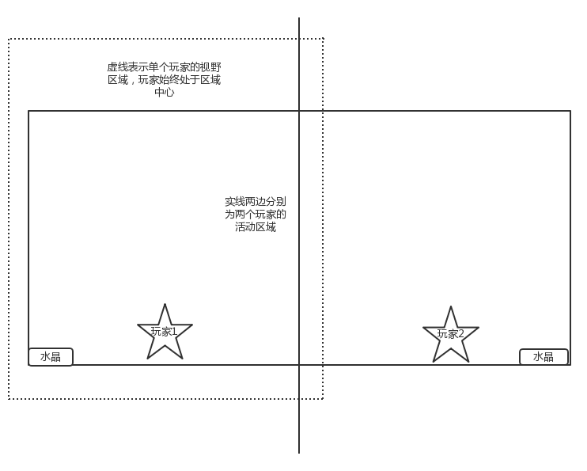

# miniGame
## 腾讯互娱游策公开课miniGame小组
### 小组成员信息

id | 微信 |主要职能
---|---|---
自由人 | shell_777 | PM
幸运E|wxid_0453084530912|策划
子豪-Yuan‼|Yzihao-adan|策划
『       』|chq1240|开发
谭骏朗|tanjunlang|开发
庄博伟|wxid_b7c7j0avvu8111|开发
甲船|wxid_w6eigiiklehs21|开发
菖蒲 | dwe2198909 | 美工
---
### 想法idea
**游戏背景：**  这里需要一个故事  
**游戏类型：**
联网双人策略对战（可拓展为pvp）  
**游戏简介：**
地图中存在很多方块，玩家通过仍方块来扣除对方水晶血量，归零则失败。也可以使用方块建造防御工事。  
**人物操作：**
拾取方块、投掷方块、放置方块、移动、跳跃。  
**核心玩法：**
通过地形及自由度相对较高的改造地形能力来获取战斗的胜利。  
**可扩充玩法：**
人物技能，方块属性（受不受重力、可不可拾取等），地图特性等。  

### 版本内容：  
[v1.0.0功能说明文档](Document/v1.0.0功能说明文档.md)  
[v1.0.0框架设计文档](Document/v1.0.0框架设计文档.md)