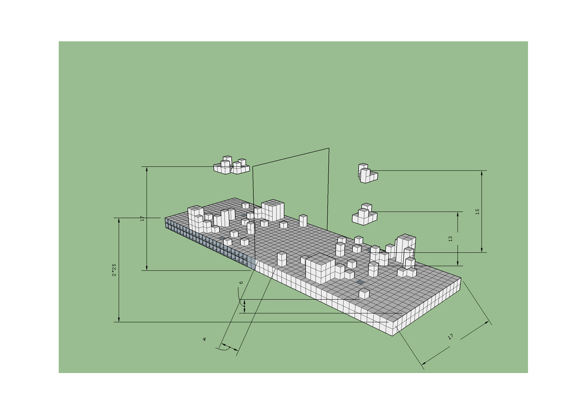
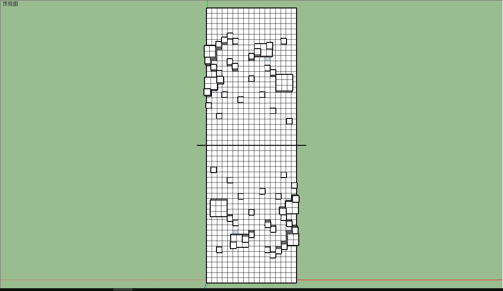
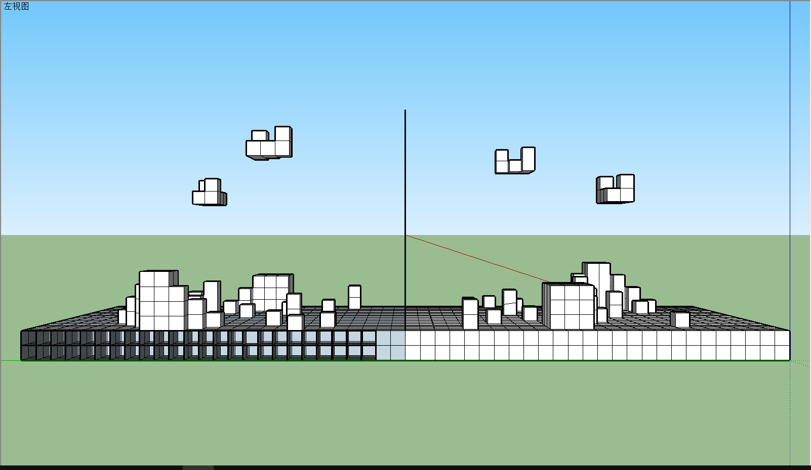
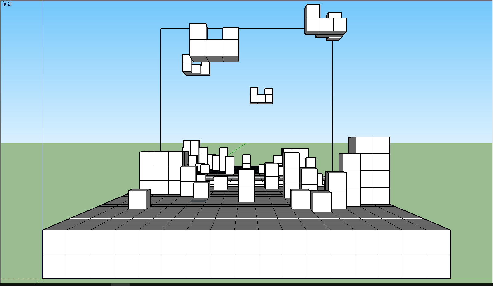

# miniGame
## 腾讯互娱游策公开课miniGame小组
### 小组成员信息

信息 | 微信 |主要职能
---|---|---
华工_夏寅皓 | shell_777 | PM
华工_刘鑫昊|wxid_0453084530912|策划
中大_袁子豪|Yzihao-adan|策划
华工_何嘉权|wxid_w6eigiiklehs21|策划
中大_陈浩强|chq1240|开发
中大_谭骏朗|tanjunlang|开发
中大_庄博伟|wxid_b7c7j0avvu8111|开发
华工_邓维尔| dwe2198909 | 美术
---
### 想法idea
**游戏背景：**  这里需要一个故事  
**游戏类型：**
3D联网 2 VS 2 四人策略对战  
**游戏简介：**
地图中存在很多方块，玩家通过仍方块来扣除对方水晶血量，归零则失败。也可以使用方块建造防御工事。  
**人物操作：**
拾取方块、投掷方块、放置方块、移动、跳跃。  
**核心玩法：**
通过地形及自由度相对较高的改造地形能力来获取战斗的胜利。  
**可扩充玩法：**
人物技能，方块属性（受不受重力、可不可拾取等），地图特性等。  
  
  
  
  
  

### 版本内容：  
[策划案](Document/策划案初稿)  
[项目进展报告](Document/项目进展报告)  

