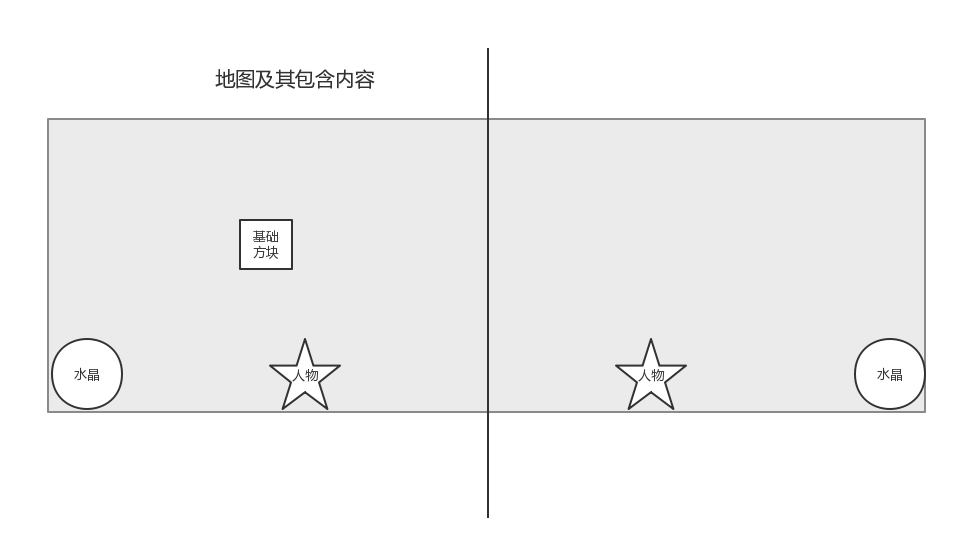
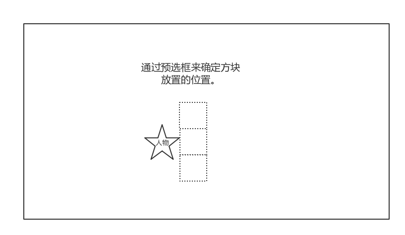

#### miniGame 1.0.0版本内容
**地图：**  
1>地图为横板2D地图  
2>地图中部为不可移动挡板  
3>地图中包含两个人物  
4>地图两侧存在两个水晶  
5>地图内存在一种基础方块  
  
**人物：**  
1>人物可通过键盘左右移动  
2>人物有三个技能：跳跃、抓取/投掷、放置方块。  
3>跳跃：通过键盘按键控制人物跳跃。高度约为1.5个方块。  
4>抓取/投掷：通过键盘按键操控。抓取正前方位置的方块，若手中已抓取方块，则向前投掷方块。  
5>投掷出的方块飞行一段距离或碰到物体时消失粉碎。  
6>放置方块：通过键盘按键操控。若手中已抓取方块，则可按住技能通过方向键调整方块放置位置。  
  
**水晶：**  
1>水晶存在一定的HP值。  
2>水晶HP值归零则该方玩家失败。  
3>投掷物碰撞水晶会扣除水晶HP。  
**基础方块：**  
1>可被玩家抓取/投掷/放置  
2>碰到物体则消失粉碎。